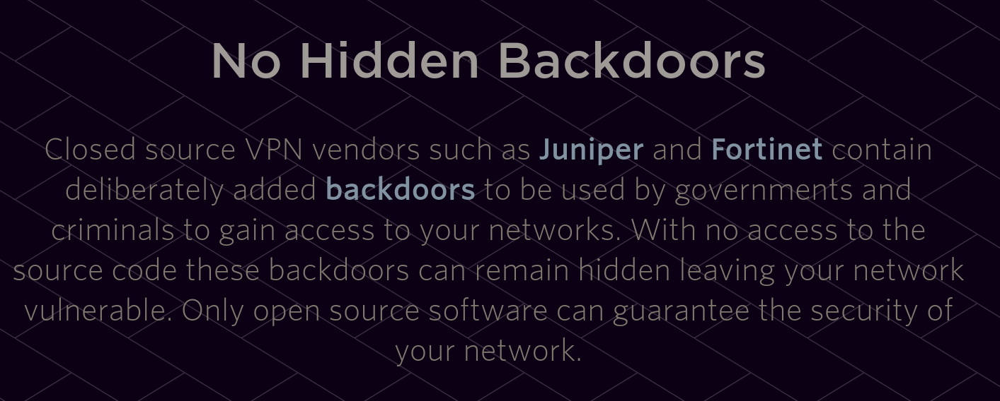

% Remote Network Access 
% https://github.com/STL2600/remote-network-access
%  

VPN/Remote Access Rundown

# SSH

The old standby

## Basic Access

 - Connect to a machine
 - Forward ports
   - From local to remote
   - From remote to local

## Basic Access

 - Pros
   - Dead simple
 - Cons
   - Not very user friendly
   - TCP based connections are slow 

## Advanced Access

Who says you can't teach an old dog new tricks?

## SOCKS Proxy

`ssh -D 1337 -N user@server`

## SOCKS Proxy

 - Pros
   - Almost all network apps support SOCKS
 - Cons
   - Not very user friendly
   - TCP based connections are slow 
   - Have to configure each app to use it

## SSH VPN

Setup your tunnel

`sudo ssh -w 0:0 user@server`

## SSH VPN

 - Pros
   - Nothing to configure per app
 - Cons
   - Not very user friendly
   - TCP based connections are slow 
   - Have to configure each route manually

# Self Hosted VPN

# OpenVPN

- Point-to-point or site-to-site VPN
- Authenticate by
  - Pre-shared keys
  - Username/password
- Based around OpenSSL for encryption

## OpenVPN

- Pros
  - Open Source
  - Tried and True
  - Lot's of features
- Cons
  - Can be tricky to setup
  - Long in the tooth
  - Not the quickest solution

# Wireguard

 - Creates point to point links
 - Configured using keys only
 - Can also be used as a gateway

# Wireguard

Server Config

```
[Interface]
Address = 10.0.0.1/24
ListenPort = 1234
PrivateKey = <SERVER PRIVATE KEY>

[Peer]
PublicKey = <CLIENT PUBLIC KEY>
AllowedIPs = 10.0.0.1/24
```

# Wireguard

Client Config

```
[Interface]
Address = 10.0.0.2/24
PrivateKey = <CLIENT PRIVATE KEY>

[Peer]
PublicKey = <CLIENT PUBLIC KEY>
AllowedIPs = 10.0.0.1/24
Endpoint = 1.2.3.4
```

# Wireguard

`wg-quick up <config file>`
`wg-quick down <config file>`

# Wireguard

 - Pros
   - Ultra simple config, just a file
   - Secure public key based auth and encryption
   - Very fast
   - Low resource usage
   - Client usage is very simple
 - Cons
   - Not very user friendly
   - Server usage can be complicated

# Virtual Networks

## What are they

 - Also called overlay networks
 - Connect multiple machines and sites together
 - Often allows p2p direct connections
 - Designed for highly distributed networks

# Hosted Virtual Networks 

## Tailscale

 - Uses wireguard under the hood
 - Uses SSO providers for auth

## Tailscale

 - Pros
   - Very simple for both users and admins
   - Same security as Wireguard
   - Very fast
   - Low resource usage
   - Generous free tier and affordable paid options
   - Clients for most systems
   - Company can not see traffic
 - Cons
   - DNS solutions are spotty

## ZeroTier

 - Uses its own encryption / auth standard, but has been reviewed
 - Supports SSO, but also usernames and passwords

## ZeroTier

 - Pros
   - Very simple for both users and admins
   - Very fast
   - Low resource usage
   - Ultra configurable
   - Self-hostable
 - Cons
   - DNS solutions are spotty
   - Free tier is less generous than others
   - Company can see traffic

# Twingate

- TLS Tunnel
- Deploys to cloud platform of your choice
- Hosts Relay and Controller components
- Connectors in the cloud function as gateways the network
- Clients for just about every device

## Twingate

- Pros
  - Lots of public documentation
  - Appears to be pretty flexible
- Cons
  - Pretty buzzword laden
  - Corporate focused
  - Not as simple to setup

# Pritunl

- Distributed openvpn, ipsec, and wireguard server
- Designed to join multiple cloud sites on one network
- Offers up to 5 layers of authentication

## Pritunl




## Pritunl

- Pros
  - Multiple protocols available
  - Open Source
  - Free tier for a single server
  - Pretty well documented
- Cons
  - Doesn't appear to be the simplest setup
  - Just GUI for existing VPN tech

# Enclave.io

- Peer-to-peer VPN.  No gateway server
- Group devices by "tags"

## Enclave.io

- Pros
  - Time limited connectivity
  - Reasonabl cost
    - Free tier up to 5 systems
    - Business tier $1.60 per system/month
  - Synology NAS client
- Cons
  - MFA requires Enterprise plan
  - Documentation pretty minimal

# Self Hosted Virtual Network

## Nebula

- Open source project by Slack
- Based on Noise Protocol (WhatsApp, WireGuard, I2P)
- Basically rage-built out of frustration with IPSec

## Zerotier

 - Technically supported as self hosted, but does not seem to be popular

## Headscale

 - A black-box implementation of the tailscale control server
 - Must use patched clients
 - Once set up is fairly user friendly
